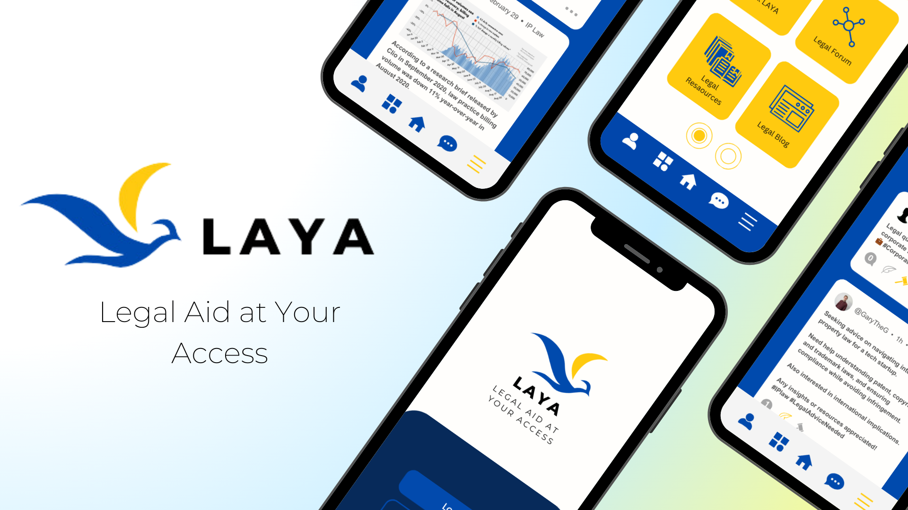
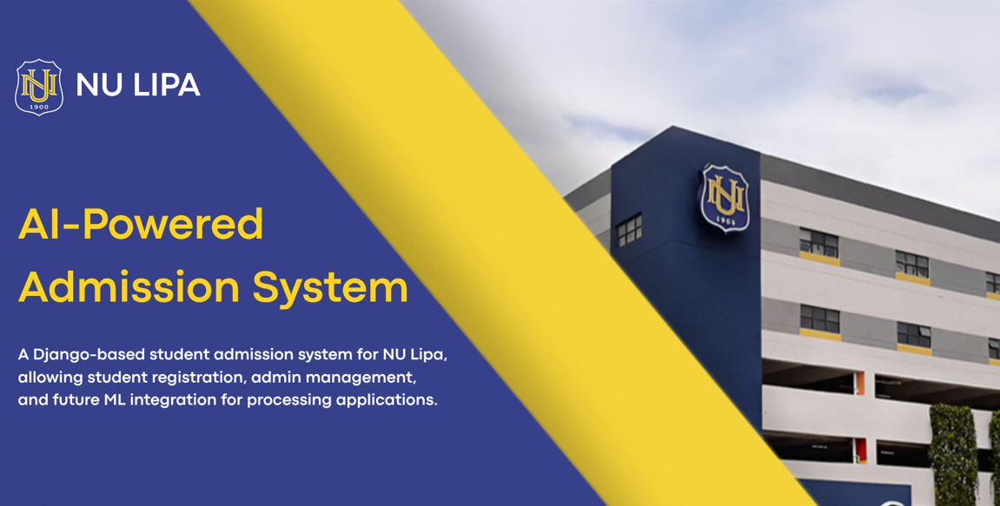
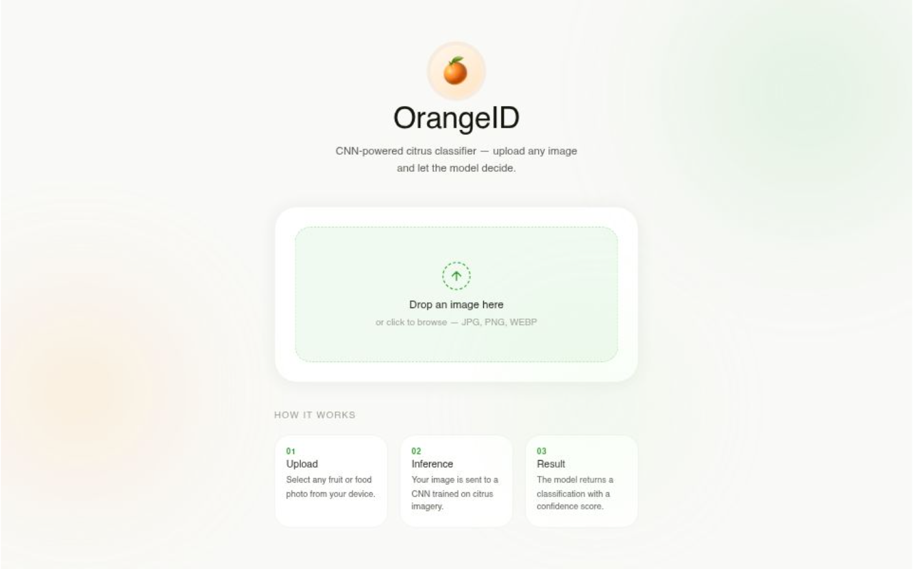
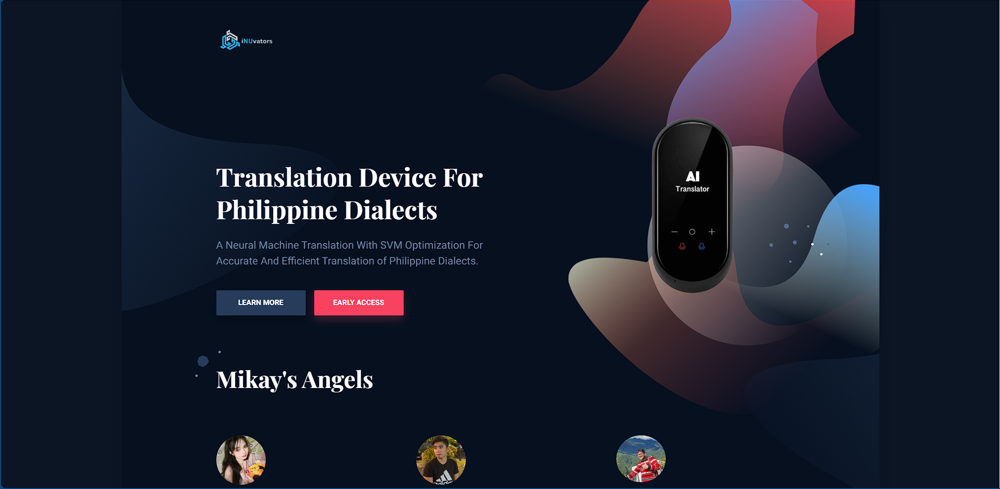
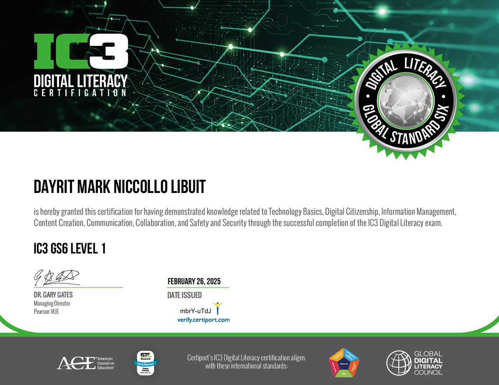
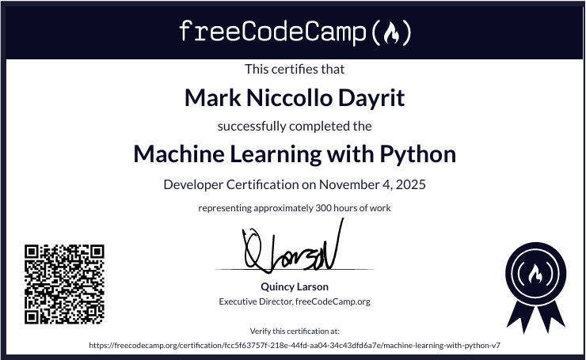
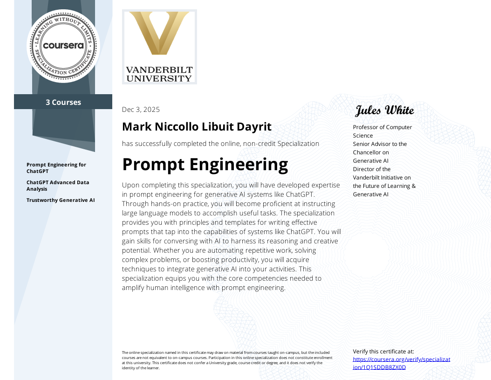
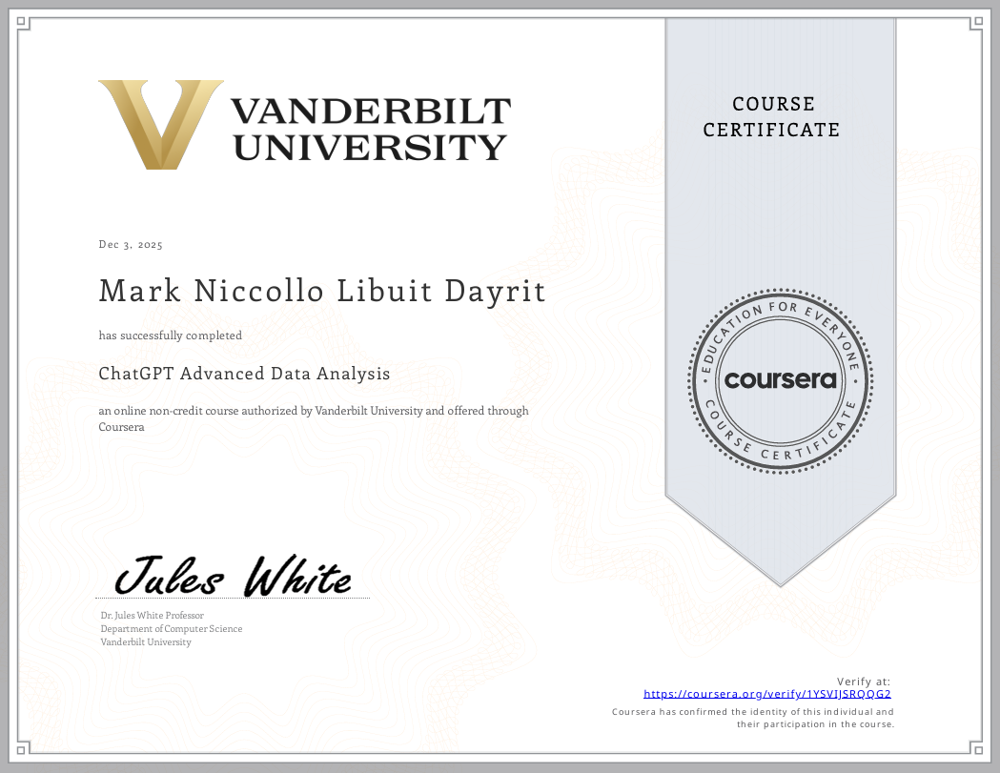
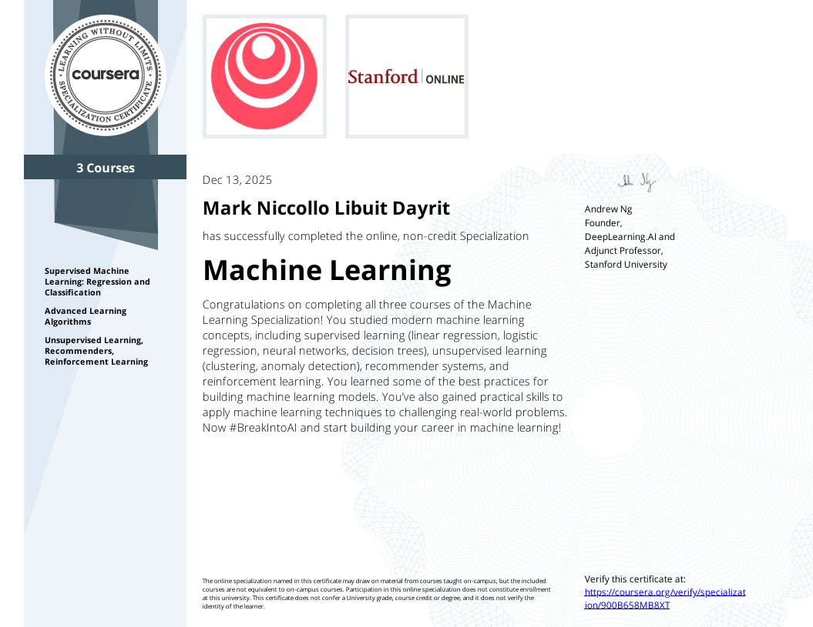

# Mark Niccollo L. Dayrit

**Computer Science Student · AI & ML Enthusiast · Frontend Developer**

National University - Lipa | Dean's Lister | iNUvators Member

---

## 👤 About Me

Hi! I'm **Niccollo**, a Computer Science student at National University - Lipa with a passion for building intelligent systems and clean frontend interfaces. I specialize in machine learning and full-stack web development — from training deep learning models to crafting responsive UIs.

- 🎓 BS Computer Science @ NU-Lipa (2022 – Present)
- 🤖 Focused on AI/ML, Deep Learning & Full-Stack Development
- 🏅 Dean's Lister | TOEIC Score: 850
- 📍 Lipa City, Batangas, Philippines
- 📬 Niccollodayrit25@gmail.com

---

## 🛠️ Languages & Tools

**Programming Languages**

**Frontend Development**

**Backend Development**

**Machine Learning & Data Science**

**Tools & Platforms**

---

## 🚀 Projects

### 🔹 Legal Aid at Your Access (LAYA)
> Bilingual conversational AI system for Philippine law using Microsoft Azure CLU. Achieved an **F1 Score of 84.43%** across 3,600 utterances.

Scraped 3,000+ legal documents, handled data annotation, multilingual intent classification, and legal-domain entity extraction. Submitted for publication in *Data in Brief*.

<!--
  Replace the image below with an actual screenshot of your project.
  Upload the image to your repo and update the path, e.g.:
  
-->

---

### 🔹 KNN Enrollment Probability Predictor
> School-commissioned ML system predicting enrollment probability for NU-Lipa Admissions using K-Nearest Neighbors.

Handpicked to join the project team; responsible for designing and developing the **frontend interface**.

---

### 🔹 AI Orange Classification
> Deep learning image classifier using **EfficientNetB0** architecture. Achieved an **F1 Score of 0.9961** and **Accuracy of 99.61%**.

Applied transfer learning, dataset augmentation, and fine-tuning in Google Colab for CNN-based image classification.

---

### 🔹 NALA Frontend
> Responsive web app for translating Philippine dialects, built as part of a Software Engineering project with the **iNUvators** team.

Responsible for the full frontend design and implementation.

---

## 📊 GitHub Stats

---

## 📜 Certifications

| Certificate | Issuer | View |
|---|---|---|
| 🏅 IC3 Digital Literacy Global Standard Six | Certiport |  |
| 🤖 Machine Learning with Python | FreeCodeCamp |  |
| 💬 Prompt Engineering Specialization | Coursera — Vanderbilt University |  |
| 📊 ChatGPT Advanced Data Analysis | Coursera — Vanderbilt University |  |
| 🧠 Machine Learning Specialization | Coursera — DeepLearning.AI |  |

<!--
  CERTIFICATE THUMBNAILS: To display cert thumbnails, add image links below each row like this:

  

  Upload your cert PDFs to a /certificates folder and thumbnails to /certificates/thumbnails in your repo.
-->

---

*Thanks for visiting! Feel free to connect on [LinkedIn](https://www.linkedin.com/in/mark-niccollo-dayrit) or explore my repositories below.* 🙂

